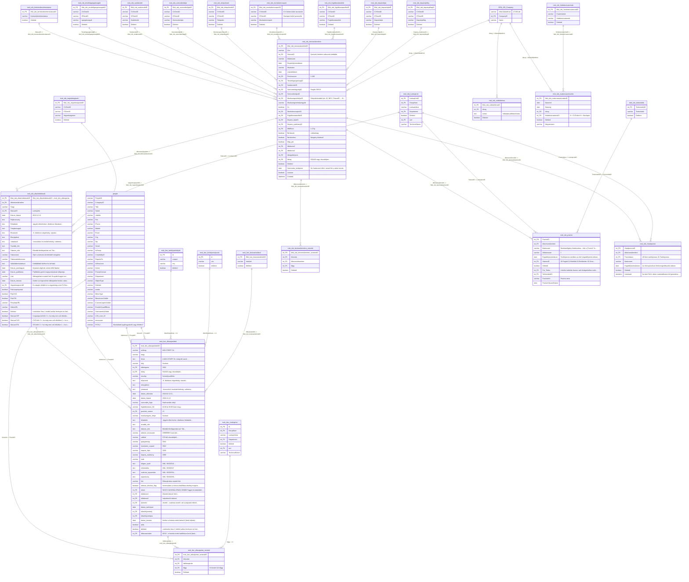

```mermaid
erDiagram
    msk_tob_allashirdetesek ||--o{ msk_kex_allasajanlatok : "msk_kex_allasajanlatokID -> Msk_tob_allashirdetesekID"
    people ||--o{ msk_kex_allasajanlatok : "idtoborzo1 -> PeopleID"
    people ||--o{ msk_kex_allasajanlatok : "idtoborzo2 -> PeopleID"
    people ||--o{ msk_kex_allasajanlatok : "idvezeto -> PeopleID"
    msk_kex_tanfolyamhelyek ||--o{ msk_kex_allasajanlatok : "idtanfolyamhely -> id"
    msk_kex_tanfolyamtipusok ||--o{ msk_kex_allasajanlatok : "idtanfolyamtipus -> id"
    msk_kex_lezarasindokok ||--o{ msk_kex_allasajanlatok : "Idlezarasindok -> Msk_kex_lezarasindokokID"
    msk_tob_keresesikerelem ||--o{ msk_tob_allashirdetesek : "Idkeresesikerelem -> Msk_tob_keresesikerelemID"
    msk_tob_LookupList ||--o{ msk_tob_allashirdetesek : "StatuszID -> LookupListID"
    msk_tob_vegzettsegiszint ||--o{ msk_tob_allashirdetesek : "VegzettsegiszintID -> Msk_tob_vegzettsegiszintID"
    people ||--o{ msk_kex_allasajanlat_vezetok : "Idvezeto -> PeopleID"
    msk_kex_allasajanlatok ||--o{ msk_kex_allasajanlat_vezetok : "idallasajanlat -> msk_kex_allasajanlatokID"
    msk_kex_LookupList ||--o{ msk_kex_allasajanlat_vezetok : "Mjgy -> id"
    msk_tob_keresesikerelemstatusz ||--o{ msk_tob_keresesikerelem : "StatuszID -> Msk_tob_keresesikerelemstatuszID"
    msk_tob_teruletiigazgatosagok ||--o{ msk_tob_keresesikerelem : "TeruletiigazgatosagID -> Msk_tob_teruletiigazgatosagokID"
    msk_tob_szakterulet ||--o{ msk_tob_keresesikerelem : "SzakteruletID -> Msk_tob_szakteruletID"
    msk_tob_szerzodesfajta ||--o{ msk_tob_keresesikerelem : "SzerzodesfajtaID -> Msk_tob_szerzodesfajtaID"
    msk_tob_telepulesek ||--o{ msk_tob_keresesikerelem : "MunkavegzeshelyeID -> Msk_tob_telepulesekID"
    msk_tob_munkakoricsoport ||--o{ msk_tob_keresesikerelem : "MunkakorcsoportID -> Msk_tob_munkakoricsoportID"
    msk_tob_foglalkoztatasifok ||--o{ msk_tob_keresesikerelem : "FoglalkoztatasifokID -> Msk_tob_foglalkoztatasifokID"
    msk_tob_kepzesfajta ||--o{ msk_tob_keresesikerelem : "Kepzes_fajtaID -> Msk_tob_kepzesfajtaID"
    msk_tob_kepzesjelleg ||--o{ msk_tob_keresesikerelem : "Kepzes_szakiranyID -> Msk_tob_kepzesjellegID"
    ORN_SZI_Company ||--o{ msk_tob_keresesikerelem : "Idceg -> AllasVallalatKod"
    msk_tob_keresesikerelem ||--o{ msk_tob_keresesikerelem_vezetok : "Idkeresesikerelem -> Msk_tob_keresesikerelemID"
    ORN_SZI_Company ||--o{ msk_tob_vallalatleiras : "Idceg -> AllasVallalatKod"
    ORN_SZI_Company ||--o{ msk_tob_csatornaszerzodes : "Idceg -> AllasVallalatKod"
    msk_tob_hirdetesicsatornak ||--o{ msk_tob_csatornaszerzodes : "HirdetesicsatornaID -> Msk_tob_hirdetesicsatornakID"
    msk_tob_keresesikerelem ||--o{ msk_tob_pozicio : "Idkeresesikerelem -> Msk_tob_keresesikerelemID"
    msk_tob_LookupList ||--o{ msk_tob_pozicio : "StatuszID -> LookupListID"
    msk_tob_torlesindok ||--o{ msk_tob_pozicio : "TorlesIndokID -> TorlesindokID"
    msk_tob_keresesikerelem ||--o{ msk_tob_headpozicio : "Idkeresesikerelem -> Msk_tob_keresesikerelemID"
    msk_tob_LookupList ||--o{ msk_tob_headpozicio : "Poziciotipus -> LookupListID"

    msk_kex_tanfolyamhelyek {
        int_PK id
        varchar csoport
        varchar nev
        boolean deleted
    }
    msk_kex_allasajanlatok {
        int_FK msk_kex_allasajanlatokID
        varchar uzletag "<COMPANY>MÁV-START Zrt.</COMPANY>"
        varchar targy "<TITLE>Jegyvizsgáló</TITLE>"
        text leiras "<DESCRIPTION>A MÁV-START Zrt. integrált vasúti ..."
        varchar hely "<LOCATIONS>   <LOCATION>Szolnok</LOCATION> </LO..."
        int_FK idkategoria "<CATEGORIES> <CATEGORY>0022</CATEGORY> </CATEGO..."
        int_FK idceg "<COMPANYID>932420</COMPANYID> vagy visszafejten..."
        varchar reszleg "<DEPARTMENT>Személyszállítás</DEPARTMENT>"
        text elvarasok "<REQUIREMENTS>-8. általános végzettség -utazási..."
        text elonytjelent "<QUALITIES>"
        text juttatasok "<BENEFITS>-hosszútávú munkalehetőség -cafeteria..."
        date datum_aktivalas "<ACTIVATION_DATE>2018-02-12</ACTIVATION_DATE> Ú..."
        date datum_lejarat "<EXPIRATION_DATE>2018-12-12</EXPIRATION_DATE>"
        varchar szerzodes_fajta "<CONTRACT>Határozatlan idejű</CONTRACT>"
        varchar foglalkoztatasi_fok "<SCHEDULE>40.00 </SCHEDULE> pl 40.00  Azaz negy..."
        int_FK poziciok_szama "<VACANCY_NR> 23</VACANCY_NR>"
        varchar munkavegzes_helye "<WORK_LOCATION>Szolnok</WORK_LOCATION>"
        text feladatok "<TASKS>-jegyek ellenőrzése -általános feladatok..."
        text tovabbi_info "<ADDITIONAL_INFO/>"
        text toborzo_info "<RECRUITER_INFO> Bővebb felvilágosítást ad: Tob..."
        varchar toborzo_torzsszam "<RECRUITER_ID>59999999</RECRUITER_ID> Csak táro..."
        varchar vallalat "<SUBSIDIARY>976</SUBSIDIARY> ból visszafejtett ..."
        varchar igazgatosag "<INDUSTRY>0042</INDUSTRY>"
        varchar munkakor_csoport "<HIERARCHY_LEVEL>0010</HIERARCHY_LEVEL>"
        varchar kepzes_fajta "<EDUCATION_TYPE>0030</EDUCATION_TYPE>"
        varchar kepzes_szakirany "<EDUCATION_FIELD>0090</EDUCATION_FIELD>"
        varchar szak "<FIELD_OF_STUDY/>"
        text idegen_nyelv "XML: <LANGUAGES> <LANGUAGE>50002542</LANGUAGE> ..."
        text informatika "XML: <ITKNOWLEDGES> <ITKNOWLEDGE>50002547</ITKN..."
        text szakmai_tapasztalat "XML: <MIN_EXPERIENCES> <MIN_EXPERIENCE>50002554..."
        text jogositvany "XML: <DRIVER_LICENSES> <DRIVER_LICENSE>50002550..."
        varchar link "Állásajánlatra mutató link"
        boolean toborzo_feluliras_flag "Amennyiben a toborzó beállítása kézileg megtört..."
        int_FK idszin "NINCS HASZNÁLATBAN 190606 Triggerrel adatokból...."
        int_FK idtoborzo1 "Állandó tobozó  NULL"
        int_FK idtoborzo2 "helyettesítő toborzó"
        int_FK idvezeto "Vezető – szakmai vezető, aki a pályázók elbírál..."
        date datum_tanfolyam
        int_FK idtanfolyamhely
        int_FK idtanfolyamtipus
        date datum_lezaras "Amikor a lezárás indok bekerül (tárolt eljárás)"
        boolean aktiv
        boolean deleted "Lezáráskor lesz 1 értékű az6az érvényes és futó..."
        int_FK Idlezarasindok "KEX2 - a lezárás indok beállításra kerül (tárol..."
    }
    msk_tob_allashirdetesek {
        int_PK Msk_tob_allashirdetesekID "Msk_tob_allashirdetesekID = msk_kex_allasajanla..."
        int_FK Idkeresesikerelem
        varchar Targy "<TITLE>Jegyvizsgáló</TITLE>"
        int_FK StatuszID "Lookuplist"
        date Datum_lejarat "<EXPIRATION_DATE>2018-12-12</EXPIRATION_DATE>"
        text Fejlecszoveg
        text Feladatok "<TASKS>-jegyek ellenőrzése -általános feladatok..."
        text Tulajdonsagok
        text Elvarasok "<REQUIREMENTS>-8. általános végzettség -utazási..."
        text Elonytjelent "<QUALITIES>"
        text Juttatasok "<BENEFITS>-hosszútávú munkalehetőség -cafeteria..."
        text Tovabbi_info "<ADDITIONAL_INFO/>"
        text Toborzo_info "<RECRUITER_INFO> Bővebb felvilágosítást ad: Tob..."
        varchar Toborzonev "Átjön a keresési kérelemből stringként"
        varchar Toborzotelefonszam
        text Vallalatibemutatkozo "Kódtáblából kitöltve és átírható."
        date Datum_jovahagyas "folyamat végének utolsó előtti lépése"
        date Datum_publikalas "Publikálás gomb megnyomásának időpontja"
        varchar Link "Állásajánlatra mutató link. Drupaltól kapjuk me..."
        date Datum_lezaras "Amikor az kapcsolódo állásajánlat lezárul, akko..."
        int_FK VegzettsegiszintID "Ez alapján küldjük el a végzettségi szint CVOex..."
        boolean Pubcsoportportal
        boolean PubCVO
        boolean PubSTA
        varchar FenykepURL
        varchar VideoURL
        boolean Deleted "Lezáráskor lesz 1 értékű az6az érvényes és futó..."
        boolean StatuszCSP "Csoportportál felé: 0 = ha még nem volt elküldv..."
        boolean StatuszCVO "CVO felé: 0 = ha még nem volt elküldve 1 = ha e..."
        boolean StatuszSTA "STA felé: 0 = ha még nem volt elküldve 1 = ha e..."
    }
    msk_kex_tanfolyamtipusok {
        int_PK id
        varchar nev
        boolean deleted
    }
    msk_kex_LookupList {
        int_PK id
        int_FK GroupNum
        varchar LookupValue
        int_FK Department
        boolean deleted
        int_FK sort
        varchar TechnicalName
    }
    people {
        varchar PeopleID
        varchar CompanyID
        varchar Title
        varchar Name
        varchar Jobtitle
        varchar Fax
        varchar Phone
        varchar Mobile
        varchar Email
        varchar City
        varchar Zip
        varchar Street
        varchar IsGroup
        varchar CreatedbyID
        varchar ReportsTo
        varchar IsResource
        varchar Active
        varchar PrivateContact
        varchar Department
        varchar ObjectType
        varchar Deleted
        varchar avatar
        varchar MenuType
        varchar MenuIconsVisible
        varchar CustomLogoIsVisible
        varchar EnableVisualEffects
        varchar UsernameIsVisible
        varchar LHS_User_ID
        varchar torzsszam
        varchar PSTLZ "Munkáltatói jogkörgyakorló vagy felettes?"
    }
    msk_kex_lezarasindokok {
        int_FK Msk_kex_lezarasindokokID
        varchar Indokok
        boolean Deleted
    }
    msk_kex_allasajanlat_vezetok {
        int_PK msk_kex_allasajanlat_vezetokID
        int_FK Idvezeto
        int_FK idallasajanlat
        int_FK Mjgy "9=Vezető 10=Mjgy"
        boolean Deleted
    }
    msk_tob_munkakoricsoport {
        int_PK Msk_tob_munkakoricsoportID
        varchar CVOextID "CV Online külső azonosító"
        varchar STAextID "Startapro külső azonosító"
        varchar Munkakoricsoport
        boolean Deleted
    }
    msk_tob_keresesikerelem {
        int_PK Msk_tob_keresesikerelemID
        varchar Cim
        int_FK StatuszID "Keresési kérelem státuszok kódtábla"
        varchar Iktatoszam
        date Engedelyezesidatum
        varchar Munkakor
        date Lejaratidatum
        int_FK Pozicioszam "1-200"
        int_FK TeruletiigazgatosagID
        int_FK SzakteruletID
        int_FK SzervezetiegysegID "People ORGH"
        int_FK SzerzodesfajtaID
        int_FK MunkavegzeshelyeID "Településlistából jön. ID, NEV, CVoextID ... St..."
        varchar Munkavegzeshelyeegyeb
        boolean Cv
        int_FK MunkakorcsoportID
        int_FK FoglalkoztatasifokID
        int_FK Kepzes_fajtaID
        int_FK Kepzes_szakiranyID
        int_FK MMKkod "1-27ig"
        boolean Berlatszik "Láthatóság"
        boolean Berkotelezo "Berigény kötelező"
        boolean Map_job
        int_FK Idtoborzo1
        int_FK Idtoborzo2
        int_FK Idengedelyezo
        int_FK Idceg "<COMPANYID>932420</COMPANYID> vagy visszafejten..."
        boolean Deleted
        date Szerzodes_befejezes "Ha 'határozott időre' veszik fel a, akkor ennek..."
        boolean Lezaras
        datetime Created
    }
    msk_tob_keresesikerelem_vezetok {
        int_PK Msk_tob_keresesikerelem_vezetokID
        int_FK Idvezeto
        int_FK Idkeresesikerelem
        int_FK Mjgy
        boolean Deleted
    }
    msk_tob_szakterulet {
        int_PK Msk_tob_szakteruletID
        varchar CVOextID
        varchar STAextID
        varchar Szakterulet
        boolean Deleted
    }
    msk_tob_szerzodesfajta {
        int_PK Msk_tob_szerzodesfajtaID
        varchar CVOextID
        varchar STAextID
        varchar Szerzodesfajta
        boolean Deleted
    }
    msk_tob_foglalkoztatasifok {
        int_PK Msk_tob_foglalkoztatasifokID
        varchar CVOextID
        varchar STAextID
        varchar Foglalkoztatasifok
        boolean Deleted
    }
    msk_tob_kepzesfajta {
        int_PK Msk_tob_kepzesfajtaID
        varchar CVOextID
        varchar STAextID
        varchar Kepzesfajta
        boolean Deleted
    }
    msk_tob_kepzesjelleg {
        int_PK Msk_tob_kepzesjellegID
        varchar CVOextID
        varchar STAextID
        varchar Kepzesjelleg
        boolean Deleted
    }
    msk_tob_teruletiigazgatosagok {
        int_PK Msk_tob_teruletiigazgatosagokID
        varchar CVOextID
        varchar STAextID
        varchar Igazgatosagok
        boolean Deleted
    }
    msk_tob_vegzettsegiszint {
        int_PK Msk_tob_vegzettsegiszintID
        varchar CVOextID
        varchar STAextID
        varchar Vegzettsegiszint
        boolean Deleted
    }
    msk_tob_keresesikerelemstatusz {
        int_PK Msk_tob_keresesikerelemstatuszID
        varchar Keresesikerelemstatusz
        boolean Deleted
    }
    msk_tob_hirdetesicsatornak {
        int_PK Msk_tob_hirdetesicsatornakID
        varchar Csatornakod
        varchar Hirdetesicsatornak
        boolean Deleted
    }
    msk_tob_vallalatleiras {
        int_PK Msk_tob_vallalatleirasID
        int_FK Idceg
        text Leiras "Vállalatra jellemző lerás"
        boolean Deleted
    }
    msk_tob_telepulesek {
        int_PK Msk_tob_telepulesekID
        varchar CVOextID
        varchar STAextID
        varchar Telepules
        boolean Deleted
    }
    msk_tob_csatornaszerzodes {
        int_PK Msk_tob_csatornaszerzodesID
        date Datumtol
        date Datumig
        int_FK Idceg
        int_FK HirdetesicsatornaID "8 = CVOnline 9 = Startapro"
        boolean Deleted
        varchar Megnevezes
    }
    ORN_SZI_Company {
        varchar AllasVallalatKod "47158.stb."
        int_PK CompanyID
        varchar Name
    }
    msk_tob_LookupList {
        int_FK LookupListID
        int_FK GroupNum
        varchar LookupValue
        int_FK Department
        boolean Deleted
        int_FK sort
        varchar TechnicalName
    }
    msk_tob_torlesindok {
        int_PK TorlesindokID
        varchar Torlesindok
        boolean Deleted
    }
    msk_tob_pozicio {
        int_PK PozicioID
        int_FK Idkeresesikerelem
        varchar Iktatoszam "Munkaerőigény iktatószáma – link a „Pozíció” fo..."
        varchar Aliktatoszam "1"
        date Engedelyezesidatum "Tanfolyamos esetben az első engedélyezési dátum..."
        int_FK StatuszID "30 Foglalt 31 Betöltött 32 Betöltetlen 33 Vissz..."
        boolean Deleted
        int_FK Pre_Torles "A törlés indoklás formon való elvégzéséhez szük..."
        int_FK TorlesIndokID
        varchar PozicioInfo "Pozicio neve"
        date PozicioVisszavDatum
    }
    msk_tob_headpozicio {
        int_PK HeadpozicioID
        int_FK Idkeresesikerelem
        int_FK Poziciotipus "40 Nem tanfolyamos 41 Tanfolyamos"
        varchar Iktatoszam
        date Engedelyezesidatum "Az első pozícióval felvitt engedélyezési dátum."
        boolean Deleted
        datetime Automata "ha nem NULL akkor automatikusan lett generálva ..."
    }
```